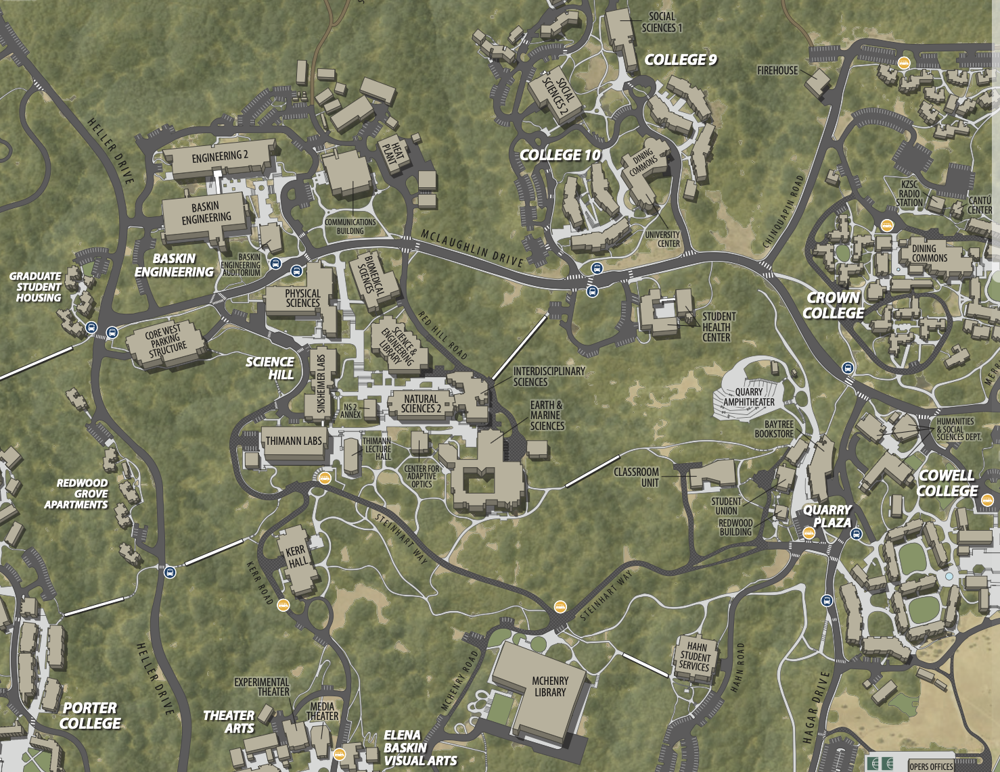
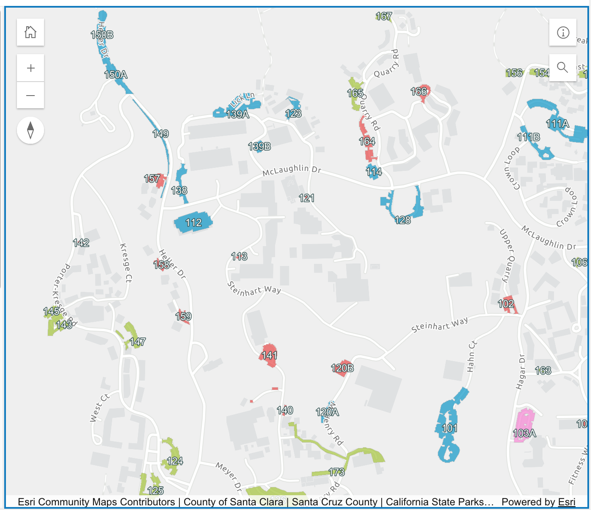
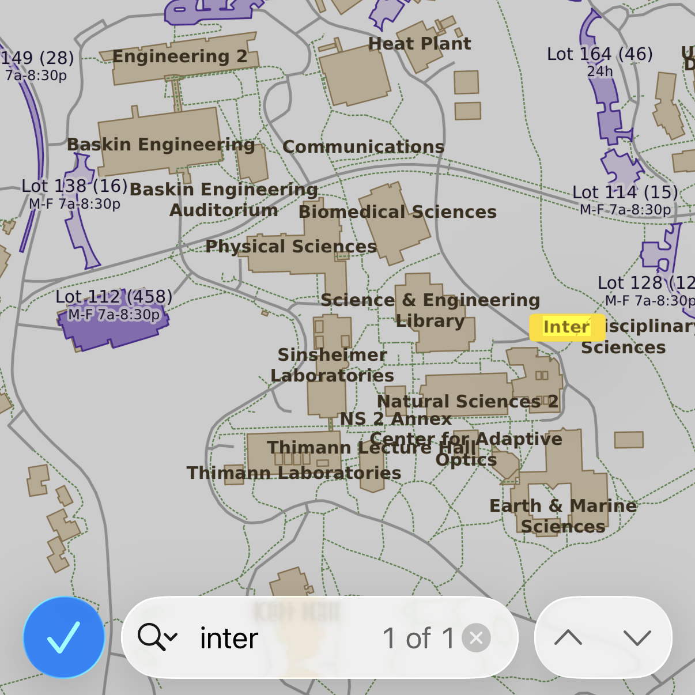
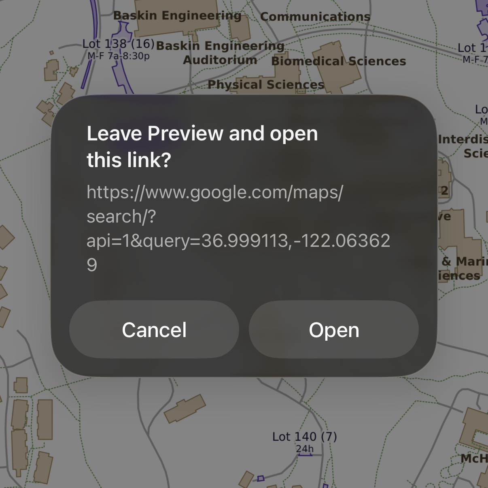

# UC Santa Cruz student parking map

**As a student with an A parking permit, I want to search for a building and find nearby parking for a class or the day.**

The [PDF building map](data/UCSC%20Campus%20Map%20Poster.pdf) works offline, but
doesn't show parking lots.

The interactive [parking map](https://transportation.ucsc.edu/parking/campus-parking-map/) requires an internet connection and clicking through a dialog every time. It shows parking lots but not building names. The color coding highlights fine divisions that don't matter to a student looking for a parking spot. The map shows many spaces that aren't available; some parking lots with a large
footprint have very few spaces available to students. When I asked about a PDF map, TAPS responded they did not have one "due to problems with version control and an increase in lot changes."

**As a software engineer and GIS student, I find this answer unsatisfying. 
This is a tractable problem: on the order of 100 parking lots,
with a rate of change measured in days or possibly weeks.**

This project creates a map to help me find parking near a campus building.
It produces a PDF for offline accessibility (Apple: save to Files, then Keep Downloaded).
The map includes searchable building names, along with parking lots available to A (student)
permit holders. The parking lots link to Google Maps to enable navigation.

 

## output

[Download the PDF map](https://kielni-ucsc.s3.us-west-1.amazonaws.com/student-parking.pdf)
(updates daily)

## how it works

The project draws the map from three data sources, combines them in Python,
and saves the result as a vector PDF. Every label is real text, so you can
search the PDF for a building name.

1. **Parking lots** come from the UCSC Transportation and Parking Services
   (TAPS) ArcGIS feature service, the same data behind the interactive map.
   The query asks the server for only lots that accept an A permit and have
   permit spaces, and returns them as GeoJSON polygons. Lots can change often, so
   the project fetches them fresh every time it runs (daily).
2. **Roads, paths, and building outlines** come from
   [OpenStreetMap](https://www.openstreetmap.org/). The project downloads a
   regional extract for Northern California from
   [Geofabrik](https://download.geofabrik.de/), then uses
   [osmium](https://osmcode.org/osmium-tool/) to clip it to the campus
   bounding box and keep only roads, footpaths, and buildings. This data
   changes rarely, so the project builds it once and reuses it.
3. **Building names** come from the campus map poster PDF. `buildings.py`
   reads the text on the poster, including labels rotated to follow a
   building, and skips road names, white area labels (colleges, fields), and
   the grid. The poster has no coordinates, so `buildings.py` also
   **georeferences** its labels: poster labels whose names match an
   OpenStreetMap building serve as control points for an affine transform
   from poster position to map position. It then places each label on its
   matching or nearest building and saves the map coordinates with the label,
   so this runs once, not on every map update.

The project reprojects all layers to UTM zone 10N (EPSG:32610), so distances
are in meters and shapes keep their true proportions. The map shades lots by
number of A permit spaces, and each lot label links to that spot in Google
Maps. [adjustText](https://github.com/Phlya/adjustText) nudges overlapping
labels apart.

| file | what it does |
|---|---|
| `buildings.py` | extracts building labels from the poster, places them on OpenStreetMap buildings, and writes `data/poster_labels.csv` |
| `main.py` | draws the map and writes the PDF and a PNG preview |
| `lambda_handler.py` | runs the daily update on AWS Lambda and uploads to S3 |
| `Makefile` | the steps below, with the data URLs and campus bounding box |

## running it locally

Dependencies:

- [uv](https://docs.astral.sh/uv/) to run Python with this project's
  packages (`uv sync` installs them)
- [osmium-tool](https://osmcode.org/osmium-tool/) for the OpenStreetMap
  extract (`brew install osmium-tool` on a Mac)
- `curl` and `jq` for downloading parking data (`brew install jq`)

`make` targets:

| command | what it does |
|---|---|
| `make all` | fetch the data and make the map |
| `make parking` | download latest parking lot features to `data/parking.geojson` |
| `make basemap` | build `data/basemap.geojson` from OpenStreetMap; the first run downloads a ~650 MB file, then keeps only the small campus clip |
| `make labels` | extract building names from the poster and place them on the basemap buildings, in `data/poster_labels.csv` |
| `make render` | draw `output/student-parking.pdf` and `output/student-parking.png` |
| `make refresh-basemap` | rebuild the basemap with newer OpenStreetMap data |
| `make clean` | delete the map outputs |

`make` only redoes steps whose inputs changed, so after the first run,
`make parking render` is enough to update the map with the latest lots.

To publish the map daily, `make deploy` builds a container image and
updates an AWS Lambda function that renders the map and uploads it to S3.
Copy `local.env.example` to `local.env` and fill in the AWS settings first.
The function needs at least 512 MB of memory and runs in about 20 seconds.